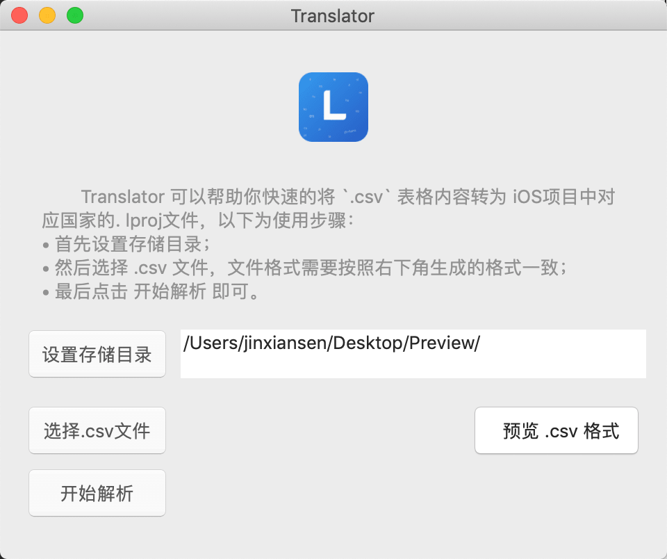
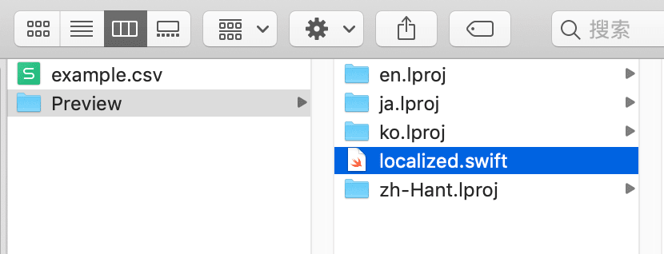
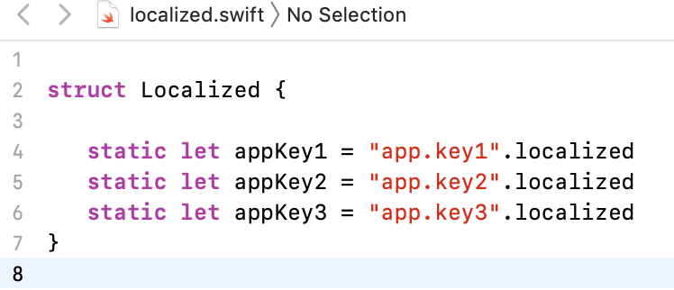

## Translator - 快速集成多语言国际化

[](https://github.com/Jinxiansen/Translator)
[](https://developer.apple.com/xcode)
[](https://developer.apple.com/macOS)
[](https://opensource.org/licenses/GPL-3.0)

[Translator](https://github.com/Jinxiansen/Translator) 可以帮助你快速的将 `.csv` 表格内容转为 **iOS/macOS** 项目中对应国家的 `. lproj` 文件。


## 💻 要求

* 运行在 macOS 10.13 及以上版本。


## 🔑 使用

使用步骤：

- 首先 **设置存储目录** ；
- 然后 **选择 `.csv`** 文件（csv 内容格式请参考 app 生成的预览 csv）；
- 最后点击 **开始解析** 即可。

## 📝 预览

- 主界面



- 预览 csv 格式

> .csv 格式文件也可由 `.xls/.xlsx` 转换得，例如在 mac App Store 搜索 `WPS`。

> 这里的 `Key` 的前半部分作为解析时创建的 `.lproj` 文件夹名称，请确保为对应语言的缩写，例如 **en(英文)** 


- 解析结果，根据添加多少种语言，生成对应的 `.lproj` 文件夹。



- 以下常量根据 **.lproj** 生成。



`. localized` 是一个 String 的扩展方法，如下所示：

```swift
extension String {
    var localized: String {
        return NSLocalizedString(self, comment: "")
    }
}
```


## ✉️ 反馈

* 如果以上功能并不能满足你的需求，可以下载源码进行修改并 Export app；
* 如果你有更好的建议，可在本项目下提一个 [Issue](https://github.com/Jinxiansen/Translator/issues/new) ，我会尝试根据你的需要新增功能；
* 如果你有其他的想法，可以来一发：hi@jinxiansen.com 。


## 📄 License	

Translator 遵循 GPL-3.0 协议进行发布。有关详细信息，见 [License](license) 。
